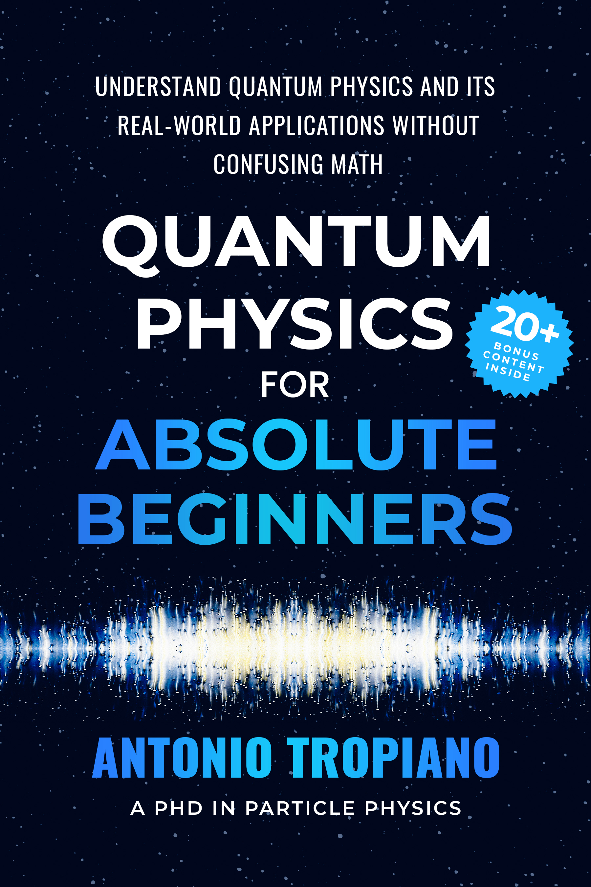

Writing those reports later and later. But hopefully they will become more interesting from next month on.

I am releasing a new book in the next weeks. It's about **Quantum Physics for Beginners**. I hold a PhD in Particle Physics and have spent several years in research. I thought it could be interesting for my small audience to read an introductory book about Quantum Physics, which is an obscure subject, often explained with unnecessary complexity. In my book, I try to explain the odd behavior of the microscopic world in simple terms, without any complicated formulas. If you want to read it for free just message me on my [X profile][personal].

Again, boring report. I have decided to focus only on **freelancing to pay the bills**, and on **self-publishing** to build a stable and growing side-income business.

## [Data Freelance][tg-datafreelance]

Paused.

## [Data Internships][datainternships]

Paused.

## [xTopics][xtopics]

Paused. But apparently I am in the top 4 Italian startups for revenue according to [trustmrr].

## [Soccrbets][soccrbets]

Paused.

## [Freelancing][personal]

Still doing it. I still have only two clients, and I am turning down offers because I cannot juggle more than that. I usually write updates on it a dedicated [TG channel][tg-datafreelance].

## [Publishing][publishing]

The book is ready. I have a cover and around **160 pages worth of content**. I have written a title and a description that should do well, according to my competitors on Amazon.

I am now planing the launch in the week starting on the 24th of November, and my goal is to get as many reviews as possible in the next month. Ideally more than 50, closer to 100.

I have improved [the website][physicsbookspress] and added links to additional content, which should please my readers.

I **have stopped ads** for my other books. It's not worth it, especially during this competitive period where billing price goes up.

## The cashflow

Time to look at the income for this month (without freelancing).

| Item                | Income/Expense |
| ------------------- | -------------- |
| Amazon book sales   | + $80.35       |
| Gumroad book sales  | + $23.24       |
| Amazon Ads          | - $30.18       |
| Book cover (fiverr) | - $58.96       |
| Appliku             | - $10.00       |
| Hetzner             | - $6.65        |
| X Premium           | - $8.72        |
| **Total**           | **-$10.92**    |

I didn't think I would end the month with another net negative.
But I guess the cover and the ads where pretty expensive. I am kind **regretting it for the cover**, and I have already asked another revision. I don't know if it's worth the money, but I wouldn't be able to do it by myself. I don't know. Judge by yourself. And let me know.

Anyway, time to go back to work. I am going to give it all to this book, and hope that it finally works. **It's almost 10 years that I am trying to build a side-income**, I tried everything and nothing worked particularly well. But I am confident that if I focus on this thing only, it can bring a big result.

Next month we will seethe first results of the new strategy. Stay tuned.

[soccrbets]: https://soccrbets.com
[xtopics]: https://xtopics.co
[personal]: https://x.com/tropianhs
[datainternships]: https://datainternships.co
[telegram-soccrbets]: https://t.me/soccrbets
[tg-datafreelance]: https://t.me/datafreelance
[xtopics-plug]: https://x.com/tropianhs/status/1929904801904521512
[publishing]: https://www.amazon.com/author/antoniotropiano
[sean]: https://www.youtube.com/@SeanDollwet
[physicsbookspress]: https://physicsbookspress.com/
[trustmrr]: https://trustmrr.com
